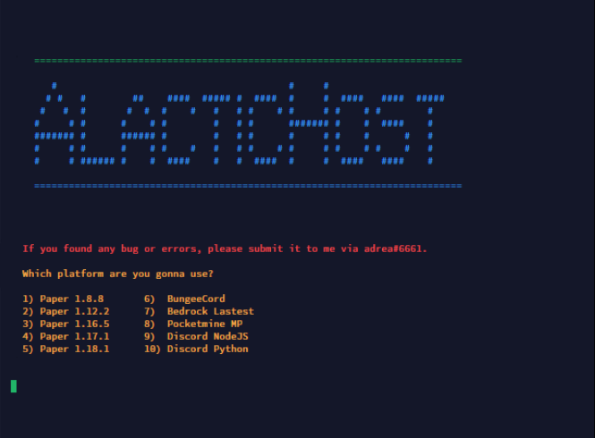

# Multi-Egg

Pterodactyl Multi-Egg that can be used to create Java and proxy servers. 

## Screenshots

## Installation

Import this [egg](https://raw.githubusercontent.com/moonarray/Multi-Egg/main/egg.json) to your Pterodactyl Server.

## License

[MIT](https://choosealicense.com/licenses/mit/)

